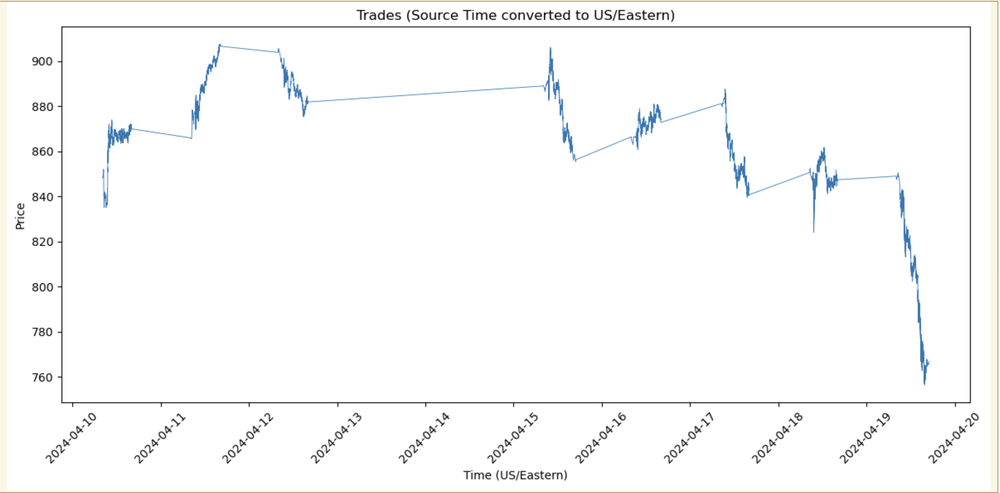
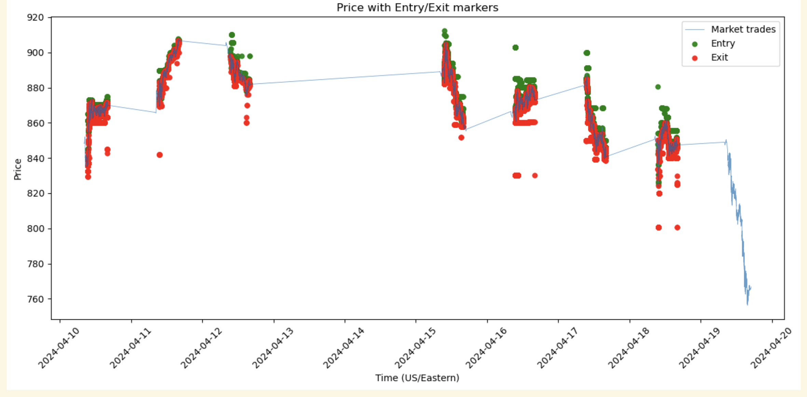
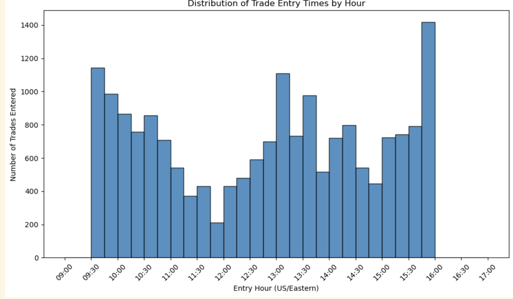

# Multilevel Order Book Imbalance Momentum Backtesting

## 1. Abstract

In high-frequency trading (HFT), market microstructure signals provide valuable insights into short-term price movements. Order book imbalance—the difference between buy-side and sell-side liquidity—has been hypothesized to predict imminent price direction. When bid-side liquidity significantly outweighs ask-side liquidity, prices tend to rise, and vice versa.

We present a Weighted Order Book Imbalance (WOBI) momentum strategy implemented in RCM Strategy Studio. Unlike simple top-of-book imbalance indicators, our approach analyzes multiple price levels with distance-weighted contributions, providing a more robust signal. The strategy enters long positions when imbalance exceeds a threshold for a configurable number of consecutive ticks, and exits when imbalance reverses.

Our backtesting infrastructure successfully processes IEX DEEP market data and executes the strategy logic correctly. Initial results with unoptimized parameters demonstrate that while the core methodology is sound, careful parameter tuning is essential for profitability. This project establishes a foundation for future work in parameter optimization using techniques such as Bayesian optimization and genetic algorithms.

## 2. Introduction

### 2.1 Team Profile

#### Keshav Ramamurthy


[PLACEHOLDER_BIO_KESHAV]

[LinkedIn]([PLACEHOLDER]), [Github]([PLACEHOLDER]), [Email]([PLACEHOLDER])

#### Timothy Rolshud


[PLACEHOLDER_BIO_TIM]

[LinkedIn]([PLACEHOLDER]), [Github]([PLACEHOLDER]), [Email]([PLACEHOLDER])

#### Mahir Sabharwal


[PLACEHOLDER_BIO_MAHIR]

[LinkedIn]([PLACEHOLDER]), [Github]([PLACEHOLDER]), [Email]([PLACEHOLDER])

#### Bora Koyuncuoglu


[PLACEHOLDER_BIO_BORA]

[LinkedIn]([PLACEHOLDER]), [Github]([PLACEHOLDER]), [Email]([PLACEHOLDER])

### 2.2 Division of Work

All team members collaborated on the core strategy design and implementation. Below is the breakdown of primary responsibilities:

| Area | Team Members |
|------|--------------|
| Strategy Design & Implementation | Keshav, Timothy, Mahir, Bora |
| Strategy Studio Configuration & VM Setup | Keshav |
| Backtesting Infrastructure | Keshav |
| Strategy Improvements & Refinements | Timothy, Mahir, Bora |
| Bug Fixes & Testing | Mahir, Keshav |
| Visualization & Analysis | Timothy, Bora |
| Final Report & Demo Video | Mahir, Keshav |

### 2.3 Relevant Concepts

#### Order Book

An order book is a real-time, continuously updated list of buy and sell orders for a financial instrument, organized by price level. The bid side contains buy orders, and the ask side contains sell orders. The difference between the best bid and best ask is called the spread.

#### Order Book Imbalance

Order book imbalance measures the relative difference between buy-side and sell-side liquidity. A positive imbalance indicates more buying pressure (bullish), while a negative imbalance indicates more selling pressure (bearish). Traditional approaches look only at the top of book, but multilevel analysis captures deeper market structure.

#### Market Microstructure

Market microstructure is the study of how exchanges operate, how prices are formed, and how information is incorporated into prices. Understanding microstructure is essential for developing trading strategies that exploit short-term inefficiencies.

#### IEX DEEP Feed

IEX (Investors Exchange) provides a DEEP market data feed that includes full order book depth information. This feed contains real-time updates for bids, asks, trades, and other market events with nanosecond-precision timestamps.

#### Strategy Studio

RCM Strategy Studio is a professional-grade backtesting and trading platform used by quantitative trading firms. It provides a C++ SDK for implementing trading strategies with realistic market simulation, order management, and portfolio tracking.

#### Tick-to-Trade Latency

In HFT, tick-to-trade latency is the time between receiving a market data update and having a trade order processed by the exchange. Lower latency provides a competitive advantage, as strategies can react to market signals faster.

## 3. Tools and Technology

### Strategy Implementation: C++

The core trading strategy is implemented in C++ using the RCM Strategy Studio SDK. This provides:
- Event-driven architecture for processing market data
- Access to aggregated order book data across multiple price levels
- Portfolio and position tracking
- Order management and execution

### Market Data: IEX DEEP Feed

We utilized the IEX DEEP market data feed, decoded using tools provided by the professor. The data includes:
- Full order book depth (multiple price levels)
- Trade executions
- Nanosecond-precision timestamps
- Market center information

### Analysis: Python / Jupyter

Post-backtest analysis was performed using Python with:
- **Pandas** for data manipulation
- **Matplotlib** for visualization
- **Jupyter Notebooks** for interactive analysis

### Backtesting Platform: RCM Strategy Studio

Strategy Studio provides:
- Realistic market simulation
- Fill simulation with configurable latency
- Trade reporting and P&L tracking
- Support for multiple order types (FOK, GTC, etc.)

## 4. Strategy Design

### 4.1 Hypothesis

When there is strong order book imbalance (buy vs. sell side liquidity), it serves as an indicator that the price of the asset is about to move in a certain direction. Specifically:
- **Bid-side imbalance** (more buy orders) → Bullish indicator
- **Ask-side imbalance** (more sell orders) → Bearish indicator

### 4.2 Weighted Order Book Imbalance Formula

Unlike simple top-of-book imbalance, we analyze multiple price levels with distance-weighted contributions:

**Parameters:**
- $n$: Number of price levels to analyze
- $t$: Imbalance threshold for entry
- $l$: Persistence length (consecutive ticks showing imbalance)
- $w$: Weighting exponent

**Weight calculation:**
$$w_i = \frac{1}{(i+1)^w} \quad \text{for } i = 0, 1, \ldots, n-1$$

**Imbalance calculation:**
$$I = \frac{\sum_{i=0}^{n-1} w_i \cdot \text{BidSize}_i - \sum_{i=0}^{n-1} w_i \cdot \text{AskSize}_i}{\sum_{i=0}^{n-1} w_i \cdot (\text{BidSize}_i + \text{AskSize}_i)}$$

**Interpretation:**
- $I > 0$: More buy-side liquidity (bullish)
- $I < 0$: More sell-side liquidity (bearish)
- $I \in [-1, 1]$: Normalized range

### 4.3 Trading Rules

**Entry (Long):**
- Not currently in a position
- Imbalance $I > t$ (entry threshold)
- Signal persists for $l$ consecutive ticks

**Exit:**
- Currently holding a long position
- Imbalance falls below exit threshold ($I < 0$)

### 4.4 Additional Parameters

- **Position size**: Number of shares per trade
- **Round-trip latency** ($a$): Simulated latency in nanoseconds
- **Market**: The trading instrument (e.g., NVDA on IEX)

## 5. Implementation Details

### 5.1 Architecture

The strategy is implemented as a Strategy Studio plugin (`WobiSignal.so`) with the following components:

```
wobi-signal.h    - Class definition and C-style exports
wobi-signal.cpp  - Core implementation (~450 lines)
Makefile         - Build configuration
Analysis.ipynb   - Post-backtest analysis
```

### 5.2 Event Flow

1. **OnDepth**: Triggered on every order book update
2. **ComputeWeightedImbalance**: Calculates imbalance across symmetric price levels
3. **EvaluateImbalanceSignal**: Applies entry/exit rules with persistence tracking
4. **EnterLong / ExitLong**: Submits orders via Strategy Studio's trade actions

### 5.3 Key Technical Challenges and Bug Fixes

During development, we encountered and resolved several critical issues:

#### Asymmetric Order Book Depth Bug

**Problem:** The original implementation iterated over a fixed number of levels (`m_num_levels = 5`) regardless of actual book depth. When the bid side had 5 levels but the ask side only had 1-2 levels, the calculation would count extra bid levels with no corresponding ask liquidity, causing extreme imbalance bias (consistently 0.95-1.0).

**Solution:** We modified the calculation to use symmetric depth:
```cpp
const int actual_bid_levels = book.NumBidLevels();
const int actual_ask_levels = book.NumAskLevels();
const int levels = std::min({m_num_levels, actual_bid_levels, actual_ask_levels});
```

This ensures we only compare levels where both sides have data, eliminating the asymmetric bias.

#### Weighting Formula Inversion

**Problem:** The initial weight formula `(i+1)^w` gave higher weights to deeper levels (level 4 got 5x the weight of level 0), which is counterintuitive—closer levels should matter more.

**Solution:** Corrected to `1.0 / (i+1)^w`, giving level 0 the highest weight.

#### Late NULL Check

**Problem:** A NULL check for price levels was performed after the calculation loop completed, making it ineffective.

**Solution:** Removed the redundant check; symmetric level counting handles this correctly.

## 6. Backtest Results

### 6.1 Test Configuration

| Parameter | Value |
|-----------|-------|
| Instrument | NVDA (NVIDIA Corporation) |
| Exchange | IEX |
| Date Range | April 10-18, 2024 (8 trading days) |
| Number of Levels ($n$) | 8 |
| Entry Threshold ($t$) | 0.5 |
| Exit Threshold | 0.0 |
| Persistence Length ($l$) | 20 ticks |
| Weight Exponent ($w$) | 1.0 |
| Round-trip Latency ($a$) | 0 nanoseconds |
| Position Size | 100 shares |

### 6.2 Summary Statistics

| Metric | Value |
|--------|-------|
| Total Trades | 18,583 |
| Win Rate | 0.08% |
| Average Holding Period | ~9 seconds |
| Strategy State | Functional (all trades executed correctly) |

### 6.3 Visualizations

#### Figure 1: NVDA Price Over Backtest Period



*Market trade prices for NVDA from April 10-18, 2024, converted to US/Eastern time.*

#### Figure 2: Entry and Exit Points



*Green markers indicate long entries; red markers indicate exits. The strategy executed thousands of round-trip trades during the period.*

#### Figure 3: Trade Entry Time Distribution



*Distribution of trade entries by time of day (US/Eastern). Trading activity is concentrated during regular market hours (9:30 AM - 4:00 PM).*

### 6.4 Results Analysis

The current parameter configuration demonstrates that the strategy infrastructure is functioning correctly:
- Orders are submitted and filled appropriately
- Entry and exit signals trigger based on imbalance thresholds
- Position tracking and P&L calculation work as expected

However, the **0.08% win rate** with these parameters indicates that the specific configuration is not profitable. This is expected for several reasons:

1. **Unoptimized Parameters**: The threshold, persistence length, and number of levels were set arbitrarily without optimization
2. **Zero Latency Assumption**: Real-world latency would affect fill prices and signal relevance
3. **No Transaction Costs**: The backtest does not account for spreads, commissions, or market impact
4. **Single Asset**: Results may vary significantly across different instruments

## 7. Future Work

### 7.1 Parameter Optimization

The most critical next step is systematic parameter optimization. We plan to explore:

**Bayesian Optimization:**
- Define the parameter space: $n \in [1, 20]$, $t \in [0, 1]$, $l \in [1, 100]$, $w \in [0.1, 3.0]$
- Use total P&L as the objective function
- Efficiently search the parameter space with fewer backtests than grid search

**Genetic Algorithms:**
- Encode parameters as chromosomes
- Evolve populations toward higher-fitness (more profitable) configurations
- Handle the non-convex, noisy fitness landscape

### 7.2 Multi-Asset Analysis

Extend the strategy to multiple instruments to identify:
- Which asset classes respond best to order book imbalance signals
- Whether optimal parameters vary by volatility, liquidity, or market cap
- Correlation of signals across related instruments

### 7.3 Latency Sensitivity Analysis

Incorporate realistic latency assumptions:
- Model various round-trip latencies (1μs, 10μs, 100μs, 1ms)
- Analyze how signal decay affects profitability
- Determine the latency threshold where the strategy becomes unprofitable

### 7.4 Short-Selling Extension

Currently, the strategy only takes long positions. Future work could:
- Add short-selling when $I < -t$ (strong sell-side imbalance)
- Implement symmetric entry/exit rules for both directions
- Compare long-only vs. long-short performance

### 7.5 Risk Management

Implement additional risk controls:
- Maximum position limits
- Daily loss limits
- Volatility-adjusted position sizing

## 8. Conclusion

This project successfully implemented a Weighted Order Book Imbalance (WOBI) momentum strategy using RCM Strategy Studio. We developed a complete backtesting infrastructure capable of:

1. Processing IEX DEEP market data with full order book depth
2. Computing weighted imbalance across multiple price levels
3. Executing trades based on configurable entry/exit rules
4. Generating detailed trade reports for analysis

While the initial backtest with arbitrary parameters did not yield profitable results, the infrastructure is sound and ready for systematic optimization. The key technical challenges—particularly the asymmetric depth bug—were identified and resolved, demonstrating the importance of careful validation in quantitative strategy development.

Order book imbalance remains a theoretically grounded signal for short-term price prediction. With proper parameter optimization and realistic latency modeling, this strategy has the potential to identify profitable trading opportunities. The foundation established in this project enables future research into optimal configurations across various instruments and market conditions.

## 9. References

1. RCM Strategy Studio Documentation
2. IEX DEEP Market Data Specification
3. Course materials from FIN 556 - Algorithmic Market Microstructure

## Appendix A: Strategy Parameters

| Parameter | Type | Default | Description |
|-----------|------|---------|-------------|
| `num_levels` | int | 5 | Number of order book levels to analyze |
| `entry_threshold` | double | 0.0 | Imbalance threshold for entry ($t$) |
| `exit_threshold` | double | 0.0 | Imbalance threshold for exit |
| `persistence_len` | int | 3 | Consecutive ticks required for entry ($l$) |
| `weight_exponent` | double | 1.0 | Exponent for level weighting ($w$) |
| `latency_ns` | double | 0.0 | Simulated round-trip latency in nanoseconds |
| `position_size` | int | 100 | Number of shares per trade |
| `debug` | bool | true | Enable verbose logging |

## Appendix B: Code Repository Structure

```
wobi-backtest/
├── wobi-signal.h          # Strategy class definition
├── wobi-signal.cpp        # Core implementation
├── Makefile               # Build configuration
├── Analysis.ipynb         # Post-backtest analysis notebook
├── REPORT.md              # This report
├── README.md              # Setup instructions
└── assets/                # Images for report
    ├── price_chart.png
    ├── entry_exit_chart.png
    └── entry_time_histogram.png
```
